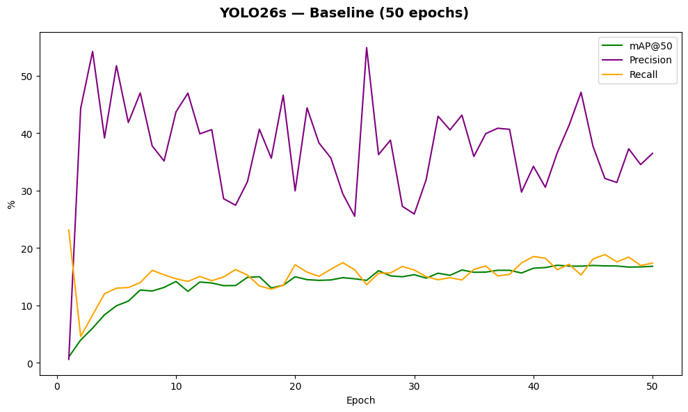
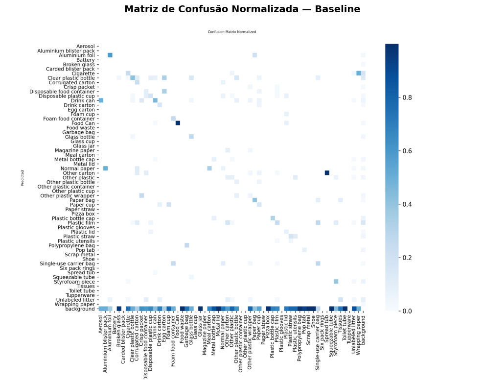
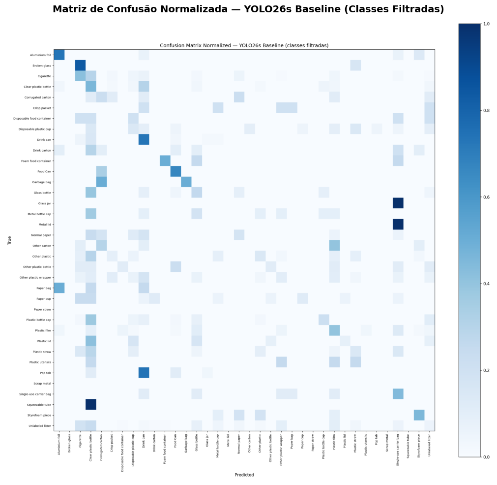
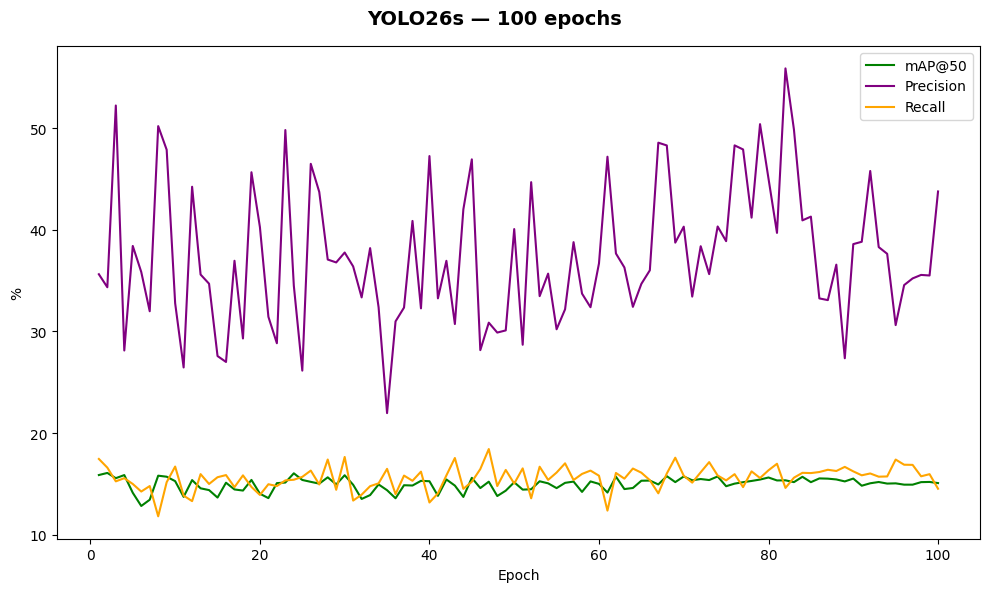
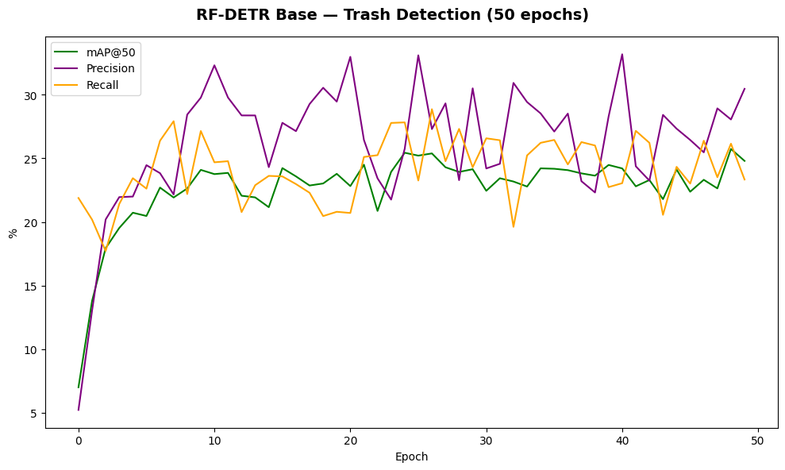
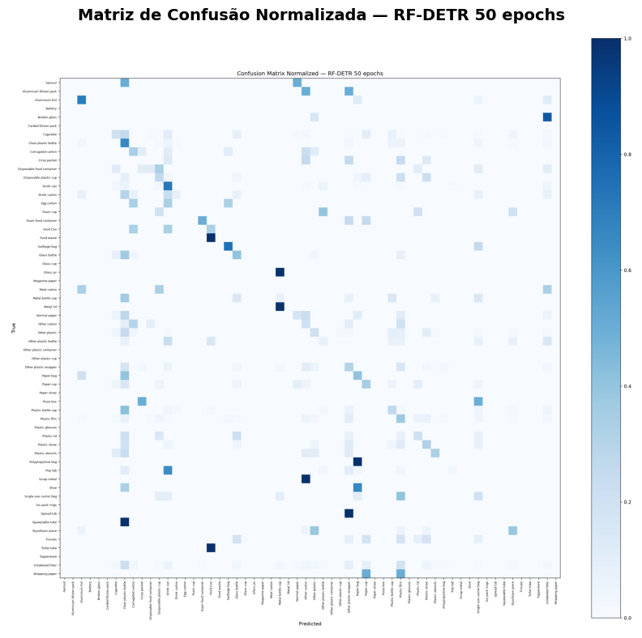
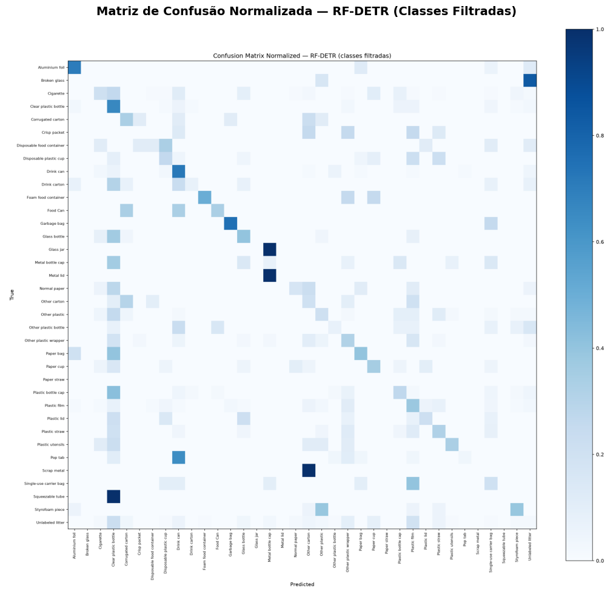

#  Detecção de Resíduos Recicláveis com YOLO26 e RF-DETR

Projeto desenvolvido para a disciplina de **Visão Computacional** do curso de Ciência da Computação da **UFRN**, com foco em detecção de objetos aplicada à triagem de resíduos recicláveis.

---

##  Descrição

Este projeto treina e compara dois modelos de detecção de objetos — **YOLO26s** e **RF-DETR Base** — em um dataset de resíduos recicláveis com 55 classes, avaliando métricas como mAP@50, Precision e Recall.

---

##  Dataset

- **Nome:** Trash Detection Dataset  
- **Fonte:** [Roboflow Universe](https://universe.roboflow.com/mariam-elhoseny-s-workspace/trash-detection-yo22t)  
- **Imagens:** 3.593  
- **Classes:** 55  
- **Formato:** YOLO26  
- **Licença:** CC BY 4.0  

---

##  Estrutura do Projeto

```
trash-detection-yolo26/
├── README.md
├── .gitignore
├── notebooks/
│   └── Trash_Detection.ipynb      ← notebook principal (Colab)
├── scripts/
│   ├── treino_yolo.sh             ← job SLURM YOLO26s 50 epochs
│   ├── treino_yolo_v2.sh          ← job SLURM YOLO26s 100 epochs
│   └── treino_rfdetr.sh           ← job SLURM RF-DETR 50 epochs
└── results/
    ├── yolo26_baseline/           ← resultados YOLO26s 50 epochs
    │   ├── comparacao_baseline.png
    │   ├── matriz_confusao_baseline.png
    │   └── matriz_confusao_yolo_filtrada.png
    ├── yolo26_100ep/              ← resultados YOLO26s 100 epochs
    │   ├── comparacao_100ep.png
    │   └── matriz_confusao_100ep.png
    └── rfdetr/                    ← resultados RF-DETR 50 epochs
        ├── comparacao_rfdetr_50ep.png
        ├── matriz_confusao_rfdetr_50ep.png
        └── matriz_confusao_rfdetr_filtrada.png
```

---

##  Metodologia

O treinamento foi realizado no cluster **NPAD/IMD-UFRN** (partição `gpu-4-a100`, GPU NVIDIA A100) via SLURM.

### Experimentos realizados

| Experimento | Modelo | Epochs | mAP@50 | Precision | Recall |
|---|---|---|---|---|---|
| Baseline | YOLO26s | 50 | 16.81% | 36.49% | 17.36% |
| V2 | YOLO26s | 100 | 15.07% | 43.78% | 14.52% |
| RF-DETR | RF-DETR Base | 50 | 25.74% | 28.06% | 26.16% |

---

##  Resultados

### YOLO26s — Baseline (50 epochs)





### YOLO26s — 100 epochs




### RF-DETR Base — 50 epochs





---

##  Como Reproduzir

### Opção 1 — NPAD/UFRN (requer acesso ao cluster)

```bash
# 1. Enviar dataset para o NPAD
scp -P 4422 "Trash detection.v2i.yolo26.zip" SEU_USUARIO@sc2.npad.ufrn.br:~/

# 2. Extrair dataset
unzip "Trash detection.v2i.yolo26.zip" -d trash-detection

# 3. Submeter job de treino YOLO26
sbatch scripts/treino_yolo.sh

# 4. Submeter job de treino RF-DETR
sbatch scripts/treino_rfdetr.sh
```

####  Comandos úteis no NPAD

```bash
# Verificar se o job está na fila/rodando
squeue -u $USER

# Acompanhar o progresso em tempo real
tail -f ~/logs/treino_*.log

# Verificar se o treino terminou com sucesso
sacct -u $USER -j SEU_JOB_ID --format=JobID,State,ExitCode,Elapsed

# Verificar os resultados salvos
ls ~/resultados/trash_baseline/
ls ~/resultados/trash_v2_100ep/
ls ~/resultados/trash_rfdetr/

# Ver as GPUs disponíveis no cluster
sinfo -p gpu-4-a100
sinfo -p gpu-8-v100
```

### Opção 2 — Google Colab / Local

```python
# Instalar dependências
!pip install ultralytics  # Para YOLO26
!pip install rfdetr       # Para RF-DETR

# Treinar YOLO26
from ultralytics import YOLO
model = YOLO("yolo26s.pt")
model.train(
    data="caminho/para/data.yaml",
    epochs=50,
    imgsz=640,
    batch=16,
    seed=42
)

# Treinar RF-DETR
from rfdetr import RFDETRBase
model = RFDETRBase()
model.train(
    dataset_dir="caminho/para/dataset",
    epochs=50,
    batch_size=8,
    lr=1e-4
)
```

---

##  Configuração do Ambiente RF-DETR no NPAD

> ⚠️ O NPAD tem restrições de compilação que impedem instalar versões recentes do `albumentations`. Use exatamente as versões abaixo para evitar erros.

```bash
# Criar ambiente conda separado
conda create -n rfdetr_env python=3.11 -y

# PyTorch compatível com CUDA 12.1 do NPAD
conda run -n rfdetr_env pip install torch torchvision \
    --index-url https://download.pytorch.org/whl/cu121

# RF-DETR e dependências
conda run -n rfdetr_env pip install rfdetr
conda run -n rfdetr_env pip install pytorch_lightning
conda run -n rfdetr_env pip install faster_coco_eval
conda run -n rfdetr_env pip install "albucore==0.0.23" --no-deps
conda run -n rfdetr_env pip install "albumentations==1.4.3" \
    "albucore==0.0.7" --no-deps
conda run -n rfdetr_env pip install scikit-learn scikit-image \
    imgaug qudida opencv-python-headless simsimd
conda run -n rfdetr_env pip install pycocotools
```

>  O pacote `stringzilla` **não compila** no NPAD devido à versão do GCC. As versões antigas do `albucore` e `albumentations` acima contornam esse problema.

---

##  Tecnologias

- [Ultralytics YOLO26](https://github.com/ultralytics/ultralytics)
- [RF-DETR](https://github.com/roboflow/rf-detr)
- Python 3.11
- PyTorch 2.5.1 + CUDA 12.1
- NPAD/UFRN — GPU NVIDIA A100

---

##  Citação do Dataset

```bibtex
@misc{ trash-detection-yo22t_dataset,
  title = { Trash detection Dataset },
  type = { Open Source Dataset },
  author = { Mariam Elhoseny's Workspace },
  howpublished = { \url{ https://universe.roboflow.com/mariam-elhoseny-s-workspace/trash-detection-yo22t } },
  url = { https://universe.roboflow.com/mariam-elhoseny-s-workspace/trash-detection-yo22t },
  journal = { Roboflow Universe },
  publisher = { Roboflow },
  year = { 2026 },
  month = { apr },
  note = { visited on 2026-06-23 },
}
```

---
